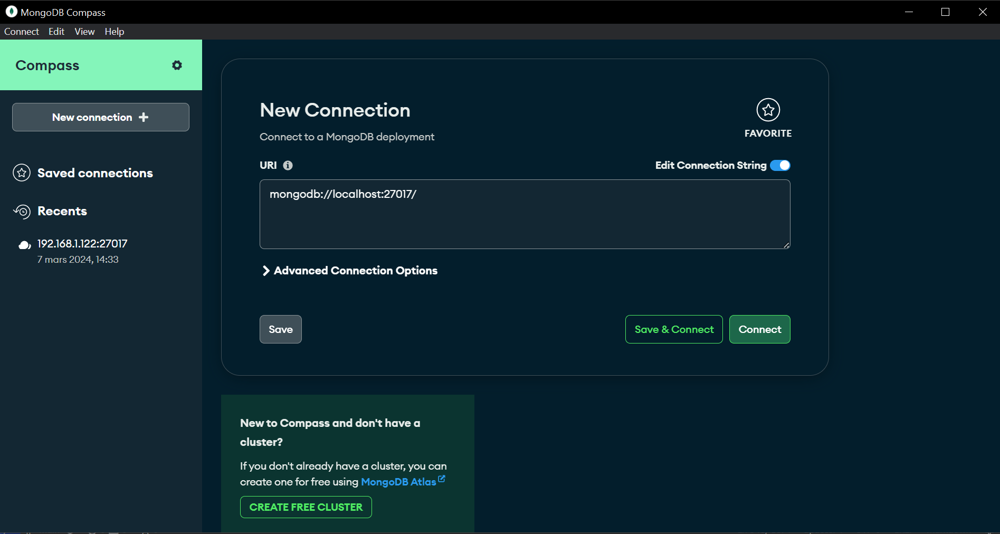
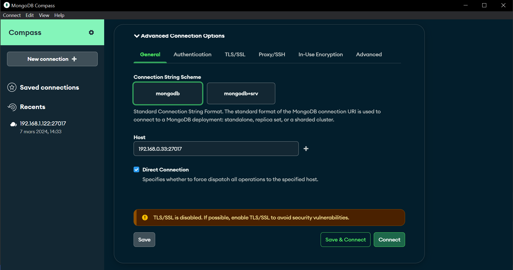
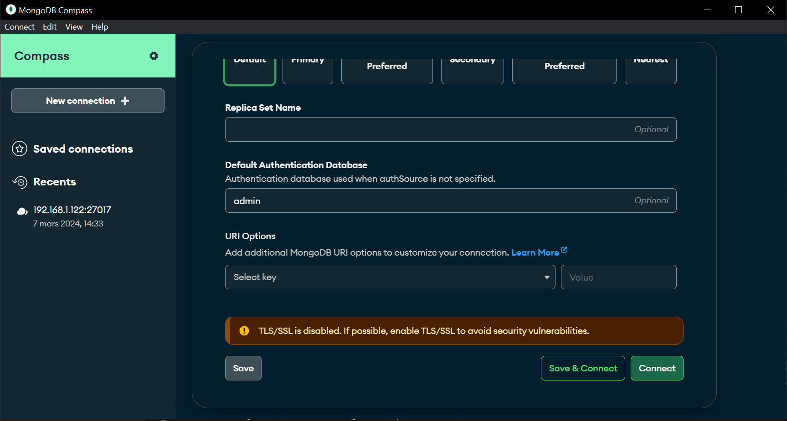

# Documentation pour les développeurs


## Projet: 

Notre logiciel, écrit en Python, offre une solution complète pour surveiller l'attribution, le renouvellement et l'expiration des baux DHCP au sein d'un réseau local. Il est conçu pour fournir une interface utilisateur, une gestion efficace des données via une base de données et une flexibilité grâce à une API REST.

## Fonctionnalités principales :

### Interface Graphique :

Notre interface graphique permet de visualiser facilement les informations sur les baux DHCP.
Des fonctionnalités de filtrage et de recherche pour accéder rapidement aux données pertinentes.
Avec notre interface graphique on obtient aussi des alertes visuelles et des notifications pour les événements critiques liés aux baux DHCP.

### Base de Données :

Nous avons un stockage sécurisé et efficace des données sur les baux DHCP sur une base de données Mongo-db.

Cette dernière prend en charge de requêtes complexes pour l'analyse.

Avec cette solution de base de données , on assure l'intergrité des données grâce à des mécanismes de sauvegarde et de récupération fournis par l'interface Mongo-DB compass.


### API REST :

Nous avons également développer une API RESTful permettant d'interagir avec le système à partir de diverses applications tierces.

Une authentification sécurisée et contrôle d'accès pour garantir la confidentialité des données.


## 2. Partie API WEB (REST) : 

Dans cette partie du projet, j'ai été en charge de la récupération directe des données depuis la base de données Mongo-DB. Ces données sont présentes en temps réel à l'aide du logiciel sniffer.

Comme l'API est un logiciel distinct, j'ai adopté une approche basée sur la Clean Architecture.

J'ai donc structuré le code de l'application en plusieurs couches, chacune ayant une responsabilité spécifique. Ces couches sont organisées comme suit :

- **Couche Données** : Cette couche est le fondement de l'architecture. Elle est responsable de la connexion à la base de données.
- **Couche Modules** : Cette couche comprend l'ensemble des fonctions que nous allons utiliser dans notre API.

Il faut savoir également qu'il y a un fichier de configuration avec les variables de connexion à la BDD.

Étant donné qu'il n'y a pas d'interaction avec l'utilisateur dans ce projet, il n'y a pas de couche d'application, car toutes les données sont présentées au format JSON.


## Code (data_manager.py) sous python : 


```python
import json
from urllib.parse import unquote, urlparse, quote_plus
from pymongo import MongoClient

class DBConnector:
    def __init__(self, config_path='C:\\Users\\m.razzaki\\OneDrive - Biodiv-wind\\Bureau\\SAE501\\SAE501\\ApiWeb\\appsettings.json'):
        with open(config_path, 'r') as config_file:
            config = json.load(config_file)

            self.mongo_username = config['MONGO_USERNAME']  # MongoDB user
            self.mongo_password = config['MONGO_PASSWORD']  # MongoDB mdp

            self.uri = unquote(config['MONGO_URI'])
            self.db_name = config['DB_NAME']

    def connect(self):
        if not self.uri.startswith('mongodb://') and not self.uri.startswith('mongodb+srv://'):
            raise ValueError('Invalid MongoDB URI: %s' % self.uri)

        parsed_uri = urlparse(self.uri)

        # ajout du username et mdp si l'uri ne les contient pas
        if not parsed_uri.username and not parsed_uri.password:
            self.uri = f"mongodb://{quote_plus(self.mongo_username)}:{quote_plus(self.mongo_password)}@{parsed_uri.hostname}:{parsed_uri.port}{parsed_uri.path}"

        # on specifie le type de connexion , avant c'était cnx directe
        client = MongoClient(self.uri)
        return client.get_database(self.db_name)

```


### DBConnector :
La classe `DBConnector` dans notre script Python facilite les connexions à notre base de données MongoDB. Elle nous permet d'interagir avec la collection MongoDB qui stocke les trames DHCP et d'effectuer des opérations sur la base de données. Voici les principaux composants et méthodes :

### Initialisation de la Classe

```python
class DBConnector:
    def __init__(self, config_path='C:\\Users\\m.razzaki\\OneDrive - Biodiv-wind\\Bureau\\SAE501\\SAE501\\ApiWeb\\appsettings.json'):
        """
        Initialise l'instance DBConnector.

        Arguments:
            config_path (str): Chemin vers le fichier de configuration (par défaut : appsettings.json).
        """
        with open(config_path, 'r') as config_file:
            config = json.load(config_file)

            # Identifiants MongoDB
            self.mongo_username = config['MONGO_USERNAME']  # MongoDB user
            self.mongo_password = config['MONGO_PASSWORD']  # MongoDB mdp

            # Décodage de l'URI MONGO à partir de la configuration
            self.uri = unquote(config['MONGO_URI'])
            self.db_name = config['DB_NAME']
```

### Connexion à MongoDB

La méthode `connect()` établit une connexion à la base de données MongoDB. Elle gère l'URI, le nom d'utilisateur et le mot de passe. Si l'URI ne commence pas par `mongodb://` ou `mongodb+srv://`, une `ValueError` est levée.

```python
    def connect(self):
        """
        Établit une connexion à la base de données MongoDB.

        En retour:
            pymongo.database.Database : La base de données connectée.
        """
        if not self.uri.startswith('mongodb://') and not self.uri.startswith('mongodb+srv://'):
            raise ValueError(f'URI MongoDB invalide : {self.uri}')

        parsed_uri = urlparse(self.uri)

        # Ajoute le nom d'utilisateur et le mot de passe à l'URI s'ils ne sont pas déjà présents
        if not parsed_uri.username and not parsed_uri.password:
            self.uri = f"mongodb://{quote_plus(self.mongo_username)}:{quote_plus(self.mongo_password)}@{parsed_uri.hostname}:{parsed_uri.port}{parsed_uri.path}"

        # Spécifie le type de connexion (auparavant connexion directe)
        client = MongoClient(self.uri)
        return client.get_database(self.db_name)
```

### Exemple d'utilisation

Pour utiliser le `DBConnector`, il faut créer une instance et appeler la méthode `connect()` :

```python
if __name__ == "__main__":
    connector = DBConnector()
    db = connector.connect()
```

Attention ! il faut remplacer les valeurs fictives (`root`, `password` et le chemin réel du fichier de configuration) par des identifiants MongoDB spécifiques et votre configuration.


## Code (Launcher.py) sous python 

```python
import json
from flask import Flask, jsonify, request, make_response
from data_manager import DBConnector
from flask_httpauth import HTTPBasicAuth
import socket


app = Flask(__name__)

db_connector = DBConnector()
auth = HTTPBasicAuth()
host = socket.gethostbyname(socket.gethostname())

with open('C:\\Users\\m.razzaki\\OneDrive - Biodiv-wind\\Bureau\\SAE501\\SAE501\\ApiWeb\\config.json', 'r') as fichier:
    users = json.load(fichier)

@auth.verify_password
def verify_password(username, password):
    if username in users and users[username] == password:
        return username

@app.route('/api/data', methods=['GET'])
@auth.login_required
def get_all_data():
    db = db_connector.connect()
    data = db.packet_dhcp.find()  
    result = [{"Type": item["Type"], "Ethernet": item["Ethernet"], "IP": item["IP"], "UDP": item["UDP"], "BOOTP": item["BOOTP"], "DHCP options": item["DHCP options"]} for item in data]
    return jsonify(result)

@app.route('/api/data/<packet_type>', methods=['GET'])
@auth.login_required
def filter_data_by_type(packet_type):
    db = db_connector.connect()
    data = db.packet_dhcp.find({"Type": packet_type})  
    result = [{"Type": item["Type"], "Ethernet": item["Ethernet"], "IP": item["IP"], "UDP": item["UDP"], "BOOTP": item["BOOTP"], "DHCP options": item["DHCP options"]} for item in data]
    return jsonify(result)

@app.route('/api/data/dhcp/source_mac/<source_mac>', methods=['GET'])
@auth.login_required
def get_dhcp_packets_by_source_mac(source_mac):
    db = db_connector.connect()
    data = db.packet_dhcp.find({"Ethernet.src": source_mac})  
    result = [{"Type": item["Type"], "Ethernet": item["Ethernet"], "IP": item["IP"], "UDP": item["UDP"], "BOOTP": item["BOOTP"], "DHCP options": item["DHCP options"]} for item in data]
    return jsonify(result)

@app.route('/api/data/dhcp/destination_mac/<destination_mac>', methods=['GET'])
@auth.login_required
def get_dhcp_packets_by_destination_mac(destination_mac):
    db = db_connector.connect()
    data = db.packet_dhcp.find({"Ethernet.dst": destination_mac})  
    result = [{"Type": item["Type"], "Ethernet": item["Ethernet"], "IP": item["IP"], "UDP": item["UDP"], "BOOTP": item["BOOTP"], "DHCP options": item["DHCP options"]} for item in data]
    return jsonify(result)

@app.route('/api/data/dhcp/source_ip/<source_ip>', methods=['GET'])
@auth.login_required
def get_dhcp_packets_by_source_ip(source_ip):
    db = db_connector.connect()
    data = db.packet_dhcp.find({"IP.src": source_ip})  
    result = [{"Type": item["Type"], "Ethernet": item["Ethernet"], "IP": item["IP"], "UDP": item["UDP"], "BOOTP": item["BOOTP"], "DHCP options": item["DHCP options"]} for item in data]
    return jsonify(result)

@app.route('/api/data/dhcp/destination_ip/<destination_ip>', methods=['GET'])
@auth.login_required
def get_dhcp_packets_by_destination_ip(destination_ip):
    db = db_connector.connect()
    data = db.packet_dhcp.find({"IP.dst": destination_ip})  
    result = [{"Type": item["Type"], "Ethernet": item["Ethernet"], "IP": item["IP"], "UDP": item["UDP"], "BOOTP": item["BOOTP"], "DHCP options": item["DHCP options"]} for item in data]
    return jsonify(result)

@app.route('/api/data/dhcp/requested_address/<requested_address>', methods=['GET'])
@auth.login_required
def get_dhcp_packets_by_requested_address(requested_address):
    db = db_connector.connect()
    data = db.packet_dhcp.find({"DHCP options.requested_addr": requested_address})  
    result = [{"Type": item["Type"], "Ethernet": item["Ethernet"], "IP": item["IP"], "UDP": item["UDP"], "BOOTP": item["BOOTP"], "DHCP options": item["DHCP options"]} for item in data]
    return jsonify(result)

@app.route('/api/data/dhcp/source_port/<source_port>', methods=['GET'])
@auth.login_required
def get_dhcp_packets_by_source_port(source_port):
    db = db_connector.connect()
    data = db.packet_dhcp.find({"UDP.sport": int(source_port)})  
    result = [{"Type": item["Type"], "Ethernet": item["Ethernet"], "IP": item["IP"], "UDP": item["UDP"], "BOOTP": item["BOOTP"], "DHCP options": item["DHCP options"]} for item in data]
    return jsonify(result)

@app.route('/api/data/dhcp/destination_port/<destination_port>', methods=['GET'])
@auth.login_required
def get_dhcp_packets_by_destination_port(destination_port):
    db = db_connector.connect()
    data = db.packet_dhcp.find({"UDP.dport": int(destination_port)})  
    result = [{"Type": item["Type"], "Ethernet": item["Ethernet"], "IP": item["IP"], "UDP": item["UDP"], "BOOTP": item["BOOTP"], "DHCP options": item["DHCP options"]} for item in data]
    return jsonify(result)

@app.route('/api/data/dhcp/server_id/<server_id>', methods=['GET'])
@auth.login_required
def get_dhcp_packets_by_server_id(server_id):
    db = db_connector.connect()
    data = db.packet_dhcp.find({"DHCP options.server_id": server_id})  
    result = [{"Type": item["Type"], "Ethernet": item["Ethernet"], "IP": item["IP"], "UDP": item["UDP"], "BOOTP": item["BOOTP"], "DHCP options": item["DHCP options"]} for item in data]
    return jsonify(result)

@app.route('/api/data/json/<packet_type>', methods=['GET'])
@auth.login_required
def filter_data_by_type_json(packet_type):
    db = db_connector.connect()
    data = db.packet_dhcp.find({"Type": packet_type})  
    result = [{"Type": item["Type"], "Ethernet": item["Ethernet"], "IP": item["IP"], "UDP": item["UDP"], "BOOTP": item["BOOTP"], "DHCP options": item["DHCP options"]} for item in data]
    
    # Convert result to JSON
    json_data = json.dumps(result, indent=4)
    
    # Prepare response
    response = make_response(json_data)
    response.headers['Content-Type'] = 'application/json'
    response.headers['Content-Disposition'] = 'attachment; filename=data.json'
    
    return response

if __name__ == '__main__':
    app.run(host=host)


```
### Dépendances:

* Flask 
* Flask-HTTPAuth
* pymongo (implicite par DBConnector)

### Configuration:

* Le fichier de configuration `config.json` stocke les utilisateurs autorisés pour accéder à l'API.
* Le chemin du fichier de configuration est défini dans la variable `fichier`.


### les points d'accès de l'API :

- `/api/data` : Récupère tous les paquets DHCP.
- `/api/data/<packet_type>` : Récupère les paquets DHCP du type spécifié.
- `/api/data/dhcp/source_mac/<source_mac>` : Récupère les paquets DHCP avec l'adresse MAC source spécifiée.
- `/api/data/dhcp/destination_mac/<destination_mac>` : Récupère les paquets DHCP avec l'adresse MAC de destination spécifiée.
- `/api/data/dhcp/source_ip/<source_ip>` : Récupère les paquets DHCP avec l'adresse IP source spécifiée.
- `/api/data/dhcp/destination_ip/<destination_ip>` : Récupère les paquets DHCP avec l'adresse IP de destination spécifiée.
- `/api/data/dhcp/requested_address/<requested_address>` : Récupère les paquets DHCP avec l'adresse IP demandée spécifiée dans les options DHCP.
- `/api/data/dhcp/source_port/<source_port>` : Récupère les paquets DHCP avec le port source spécifié dans la couche UDP.
- `/api/data/dhcp/destination_port/<destination_port>` : Récupère les paquets DHCP avec le port de destination spécifié dans la couche UDP.
- `/api/data/dhcp/server_id/<server_id>` : Récupère les paquets DHCP avec l'ID de serveur spécifié dans les options DHCP.
- `/api/data/json/<packet_type>` : Télécharge automatiquement les paquets DHCP du type spécifié en .JSON.


### Classes:

* **DBConnector:** 
    * Etablit la connexion à la base de données MongoDB.
    * Fournit des méthodes pour interroger la collection `packet_dhcp`.


### Requêtes Authentification:

Toutes les requêtes API nécessitent une authentification de base HTTP avec un nom d'utilisateur et un mot de passe valides stockés dans le fichier `config.json`.


**Remarques:**

* Le code suppose que la base de données MongoDB est en cours d'exécution et accessible sur l'hôte local.


## Test de l'API avec POSTMAN : 

Postman est un logiciel qui se focalise sur les tests des API. Il est devenu très populaire pour tester les microservices, notamment grâce à sa simplicité et ses fonctionnalités très spécialisées.


Voici les principales fonctionnalités à connaître pour les tests :

- ( 1 ) : Ici on peut choisir le type de requête à envoyer : GET, POST, PUT, etc, dans le cas de notre API c'est toujours des requêtes GET.

- ( 2 ) : L'URL de l'API.

- ( 3 ) : l'authorisation , c'est ici qu'on tape les identifiants/mot de passe pour s'authentifier afin d'accèder aux données de l'api.

- ( 4 ) : Ici ont retrouve les connexions que vous avez créées.

- ( 5 ) : Ici on trouve le résultat de la requête, dans notre cas nos données JSON.


## Accès à la base de données avec Mongo-DB COMPASS : 


Compass est un outil interactif gratuit qui permet d'interroger, d'optimiser et d'analyser les données MongoDB: 

Pour se connecter sur la base de données, on remplis les champs de connexion :



On spécifie l'adresse IP et le port de la BDD : 




Ensuite pour l'authentification , on précise l'identifiant et le mot de passe de la BDD : 


On choisit ensuite l'option d'authentification, dans notre cas c'est SCRAM-SHA-1 : 


Default Authentication Database : fait référence à la base de données utilisée pour l'authentification lorsque l'option authSource n'est pas spécifiée dans l'URI de connexion à MongoDB.


